# 空间插值任务：9km → 1km 多变量插值与评估
本项目旨在实现从 9km 分辨率气象场到 1km 分辨率的高精度空间插值，并对多种插值算法进行系统性比较与验证。插值变量包括：**温度、降水、地表太阳辐照度、10米风速**。

## 实现代码在文件xfdataprocess.py

## 由于时间及内存原因，*时间步处理其中一步*，部分任务仅选择新疆地区，ERA5数据因下载队列问题只有温度、uv风。

##  任务概述
- **插值目标**：将 9km 网格数据插值至 1km 分辨率  
- **插值变量**：2m 温度、总降水、地表太阳辐照、10m 风速  
- **插值算法实现与比较**：
  - 双线性插值（Bilinear Interpolation）
  - 反距离加权（Inverse Distance Weighting, IDW）
  - 临近插值【自选算法】
  - 克里金插值（内存原因并未使用）
- **验证策略**：
  - **自验证**：随机点验证 + 区域误差分析（新疆、四川、山西、江苏）
  - **外部验证**：与 ERA5/ERA5-Land 再分析数据对比
- **可视化**：插值结果、误差分布、ERA5对比图

~~未完成任务：~~ 
  ~~不同区域分布分析~~ 
  ~~空间分布模式对比~~ 
---
---

- **验证策略**：
  主要函数（已完成所有插值算法）：
  ```python
  def analyse_extract_meteorological_data(extracted_data,lat,lon,var,era5,elon,elat):
  ```
  - **随机点验证**：
  调用函数：
  ```python
  def random_point_validation(data_9km, data_1km, lon_9km, lat_9km, lon_1km, lat_1km, n_samples=3)
  ```
  - **ERA5对比**:
  调用函数：
  ```python
  rmse, mae, correlation = calculate_basic_metrics(era5[t,:60,:92],downsampled_25km)
  # 打印结果
  print_basic_metrics(rmse, mae, correlation,var)
  ```
### 与ERA5误差分析
  |        | t2m  |u10 |v10|
  |  ----  | ----  |---- |---- |
  | RMSE  | 14.3383|2.6739| 3.5836|
  | MAE  | 11.8680 | 2.1195 |2.7976|
  | 相关系数 | -0.1336 |-0.0643|0.0431|

  #### 原因分析：
  - 算法选择：不同的插值算法对最终结果的精度有显著影响
  - 数据来源：原始数据与ERA5可能来自不同的观测系统或模型，并且经过降采样加重数据丢失
  - 系统性偏差：不同数据源的校准和验证标准可能不同
  - 尺度效应：从9km到1km再到25km的转换过程中存在信息损失，并且原始数据经纬度与ERA5经纬度并未完全一致
    
##  可视化结果图：
  ### 三种插值结果
  - **t2m**
 
  - **u10**
 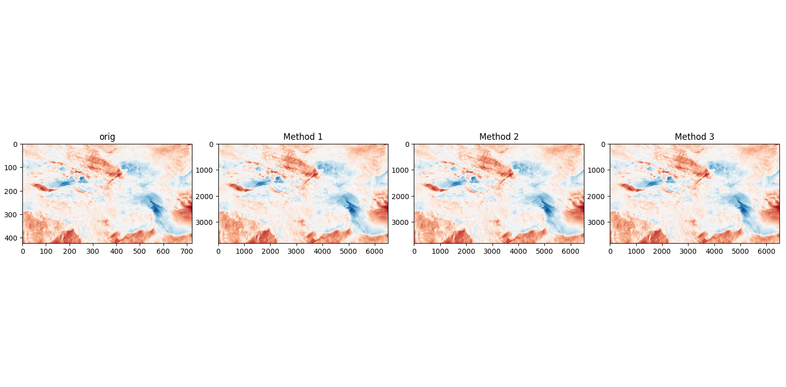
  - **v10**
 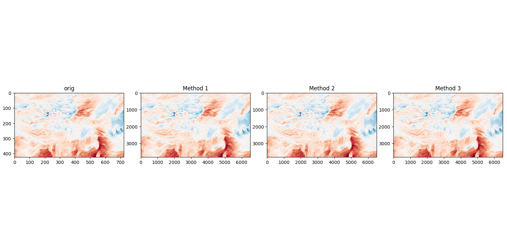
  - **tp6h**
 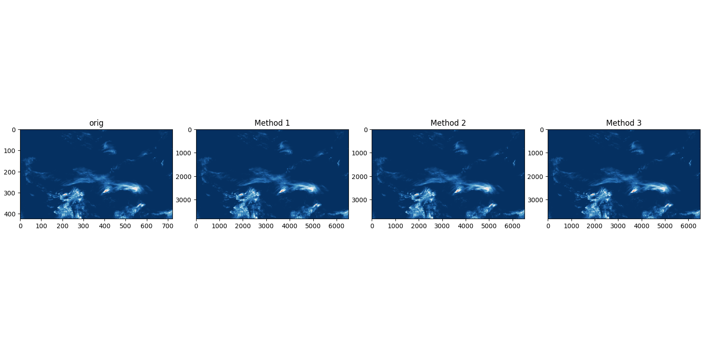
  - **ssr6h**
 
 ### 误差分布
  - **t2m**
 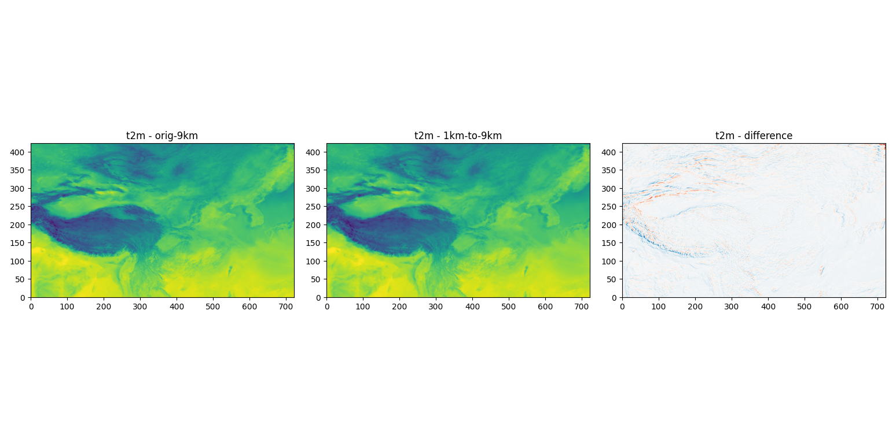
  - **u10**
 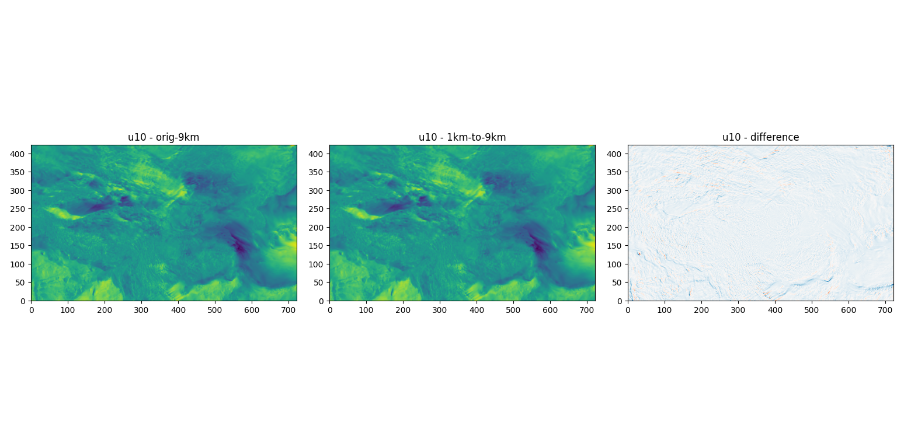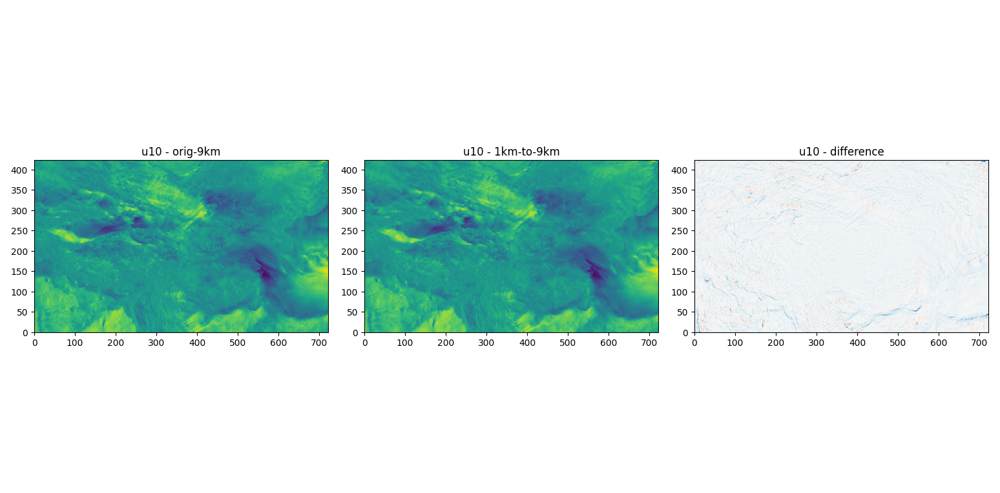
  - **v10**
 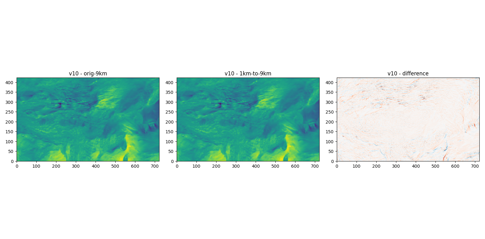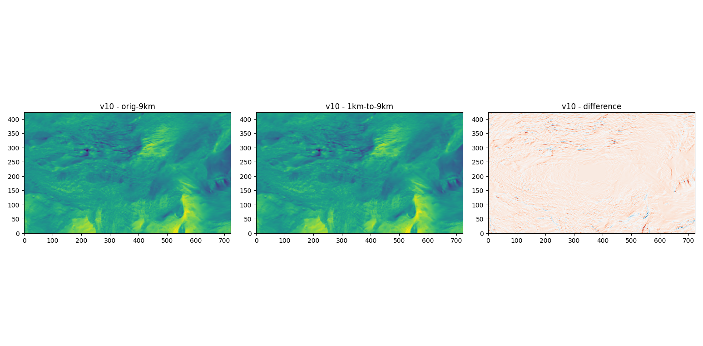
  - **tp6h**
 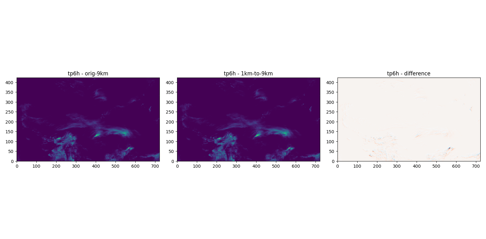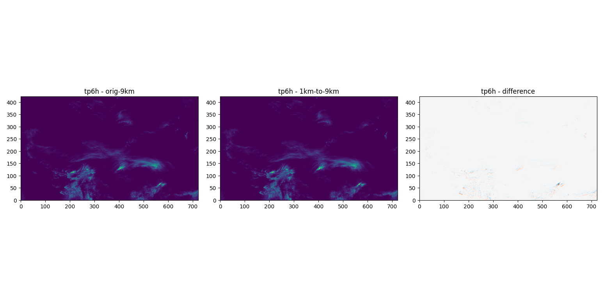
  - **ssr6h**
 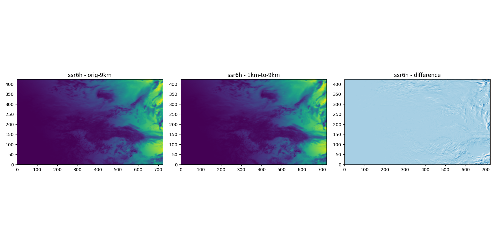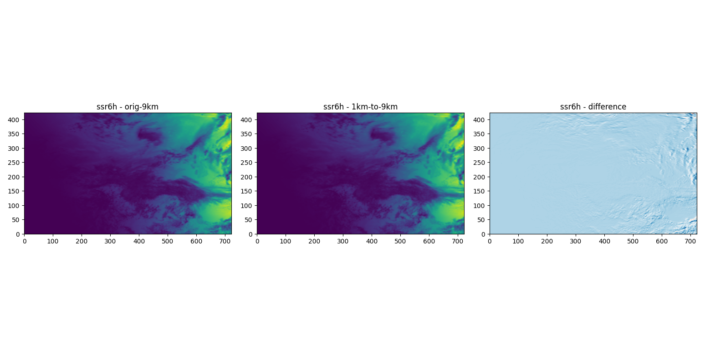
 ### ERA5对比图(下载队列问题只下载了三个变量，并对齐到新疆区域)
 - **t2m**
 
  - **u10**
 
  - **v10**
 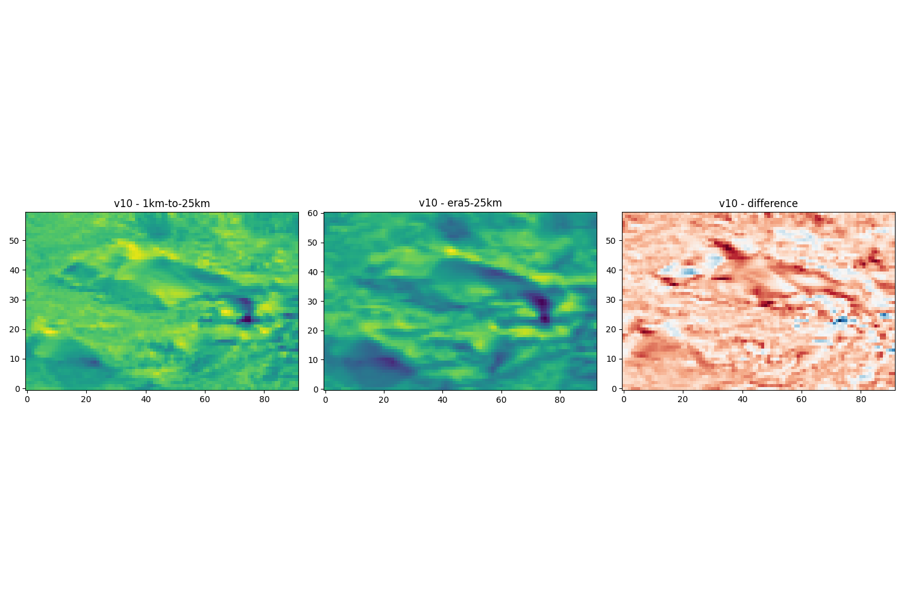


 graph TD
    %% 定义样式
    classDef input fill:#f9f9f9,stroke:#333,stroke-width:1px;
    classDef model fill:#e1f5fe,stroke:#0277bd,stroke-width:2px;
    classDef fusion fill:#f3e5f5,stroke:#7b1fa2,stroke-width:2px;
    classDef process fill:#e8f5e9,stroke:#2e7d32,stroke-width:2px;
    classDef output fill:#fff3e0,stroke:#ef6c00,stroke-width:2px;

    %% 节点定义
    Input[输入: 过去12个月多变量场<br>维度: [12, 12, 40, 236]]:::input
    
    %% 编码阶段：双流
    Input --> Split{变量分流}
    
    Split -->|表层动力流| EncA[表层流编码器<br>处理: SSTA, 风应力, 热通量等<br>架构: 3D CNN + 特征金字塔]:::model
    Split -->|次表层热力流| EncB[次表层流编码器<br>处理: 7层温跃层温度异常<br>架构: 3D CNN + 特征金字塔]:::model
    
    EncA --> FeatA[表层特征 F_surface]
    EncB --> FeatB[次表层特征 F_subsurface]
    
    %% 融合阶段：耦合与注意力
    FeatA & FeatB --> Couple[动态门控耦合模块<br>计算权重 alpha<br>F_fused = alpha*F_surface + (1-alpha)*F_subsurface]:::fusion
    Couple --> Compressed[压缩后的隐空间特征]:::fusion
    
    Compressed --> Attn1[第一阶段: 小窗口注意力<br>捕捉局部上下文关联]:::fusion
    Attn1 --> Attn2[第二阶段: 大窗口注意力<br>建模跨洋盆遥相关]:::fusion
    Attn2 --> GlobalZ[全局隐状态 Z]
    
    %% 解码阶段：重构
    GlobalZ --> TimeExt[时间维度扩展<br>3D CNN 上采样至 18 个月]:::process
    TimeExt --> SpaceUp[空间分辨率恢复<br>反卷积 上采样]:::process
    SpaceUp --> PredHead[预测头<br>1x1 卷积层]:::process
    PredHead --> Output[输出: 未来18个月多变量预测场]:::output

