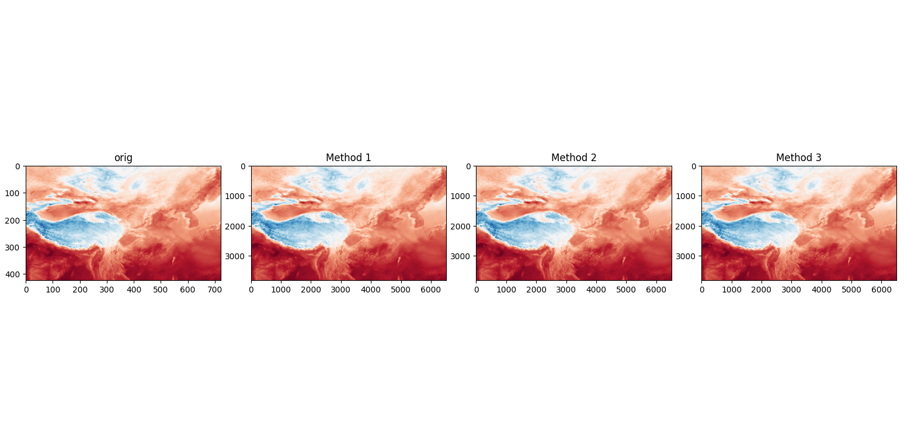

# 空间插值任务：9km → 1km 多变量插值与评估
本项目旨在实现从 9km 分辨率气象场到 1km 分辨率的高精度空间插值，并对多种插值算法进行系统性比较与验证。插值变量包括：**温度、降水、地表太阳辐照度、10米风速**。
##  任务概述

- **插值目标**：将 9km 网格数据插值至 1km 分辨率  
- **插值变量**：2m 温度、总降水、地表太阳辐照、10m 风速  
- **插值算法实现与比较**：
  - 双线性插值（Bilinear Interpolation）
  - 反距离加权（Inverse Distance Weighting, IDW）
  - 临近插值【自选算法】
  - 克里金插值（内存原因并未使用）
- **验证策略**：
  - **自验证**：随机点交叉验证 + 区域误差分析（新疆、四川、山西、江苏）
  - **外部验证**：与 ERA5/ERA5-Land 再分析数据对比
- **可视化**：插值结果、误差分布、ERA5 对比图

---

## 由于时间及内存原因，时间步处理其中一步，部分任务仅选择新疆地区，ERA5数据因下载队列问题只有温度、uv风。

##  可视化结果图：
 - 三种方法 -
 **t2m**
 
 
